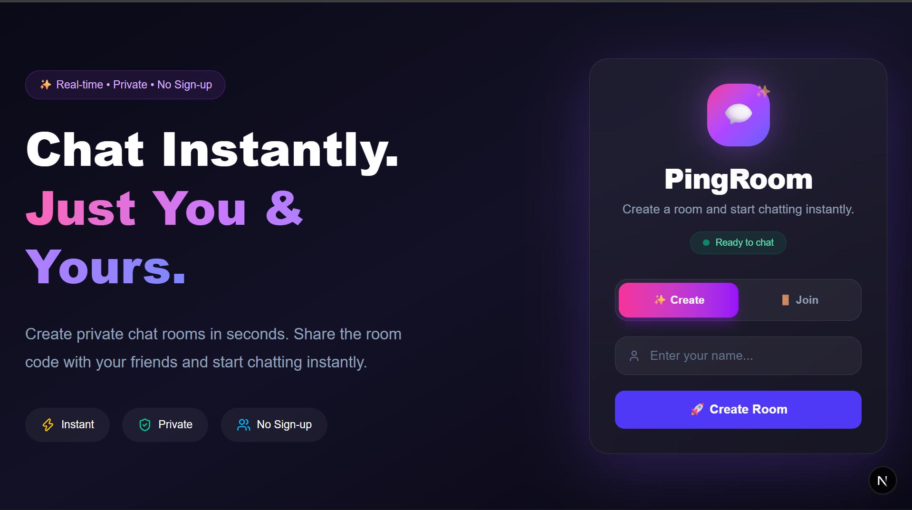
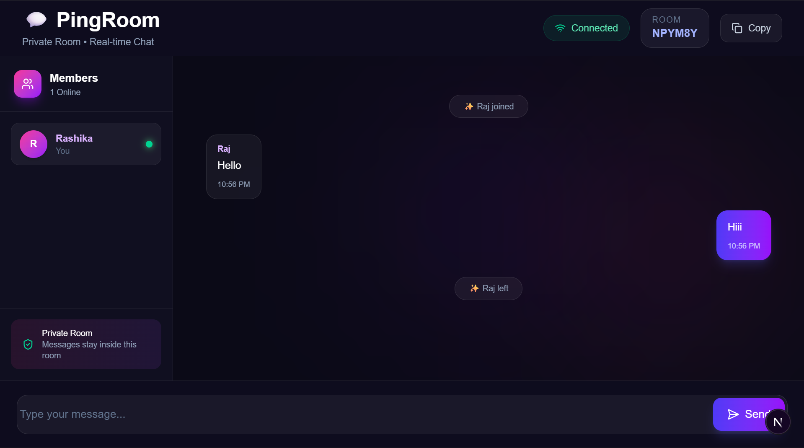
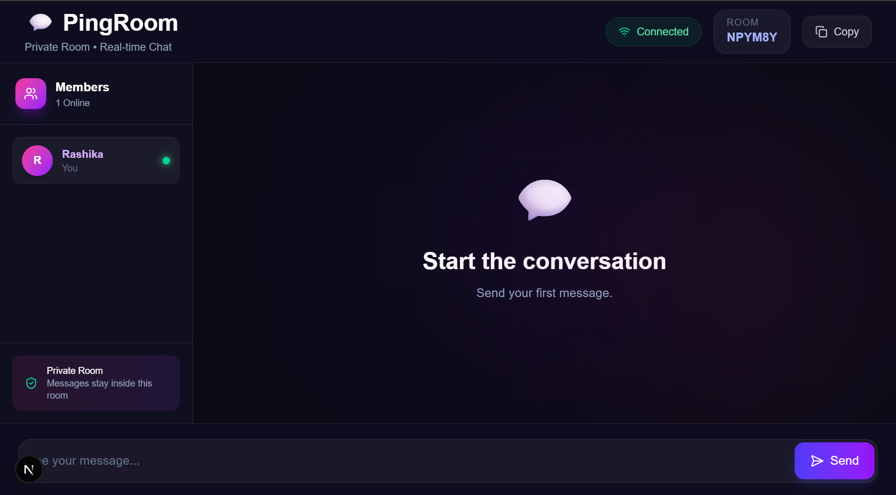

# 💬 PingRoom

<p align="center">

# Modern Real-Time Private Chat Application

Create a private room • Share the room code • Chat instantly 🚀

</p>

<p align="center">


</p>

---

# 📸 Homepage

<p align="center">

</p>

---

# 💬 Chat Room

<p align="center">





</p>

---

# ✨ Features

- 🚀 Create private chat rooms instantly
- 🔗 Join rooms using a room code
- 💬 Real-time messaging
- 👥 Live online members
- 📋 One-click room code copy
- 🔒 Private rooms (No Sign-up)
- 🎨 Modern Glassmorphism UI
- 📱 Responsive Design

---

# 🛠 Tech Stack

### Frontend

- Next.js
- React
- TypeScript
- Tailwind CSS
- Lucide React

### Backend

- Node.js
- Express.js
- Socket.IO

---

# 📂 Project Structure

```text
PingRoom
│
├── client
│   ├── app
│   ├── components
│   ├── hooks
│   ├── lib
│   └── types
│
├── server
│   ├── src
│   └── socketHandler.ts
│
├── screenshots
│   ├── home.png
│   └── chat.png
│
└── README.md
```

---

# 🚀 Installation

Clone the repository

```bash
git clone https://github.com/rashikacodes/ping-room.git
```

Go into the project

```bash
cd PingRoom
```

Install frontend

```bash
cd client
npm install
```

Install backend

```bash
cd ../server
npm install
```

Run backend

```bash
npm run dev
```

Run frontend

```bash
cd ../client
npm run dev
```

Open

```
http://localhost:3000
```

---

# 🚀 Future Improvements

- 😊 Emoji Support
- 📎 File Sharing
- ✍️ Typing Indicator
- 🔔 Notifications
- 🌙 Dark / Light Theme
- 💾 Persistent Chat History

---

# 👩‍💻 Author

**Rashika Shah**

GitHub: https://github.com/rashikacodes

LinkedIn: https://www.linkedin.com/in/rashika-shah-659451343/

---

⭐ If you like this project, consider giving it a star!